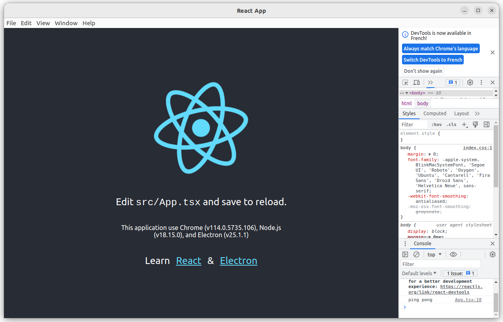

 

[](https://github.com/rodolphe37/electron-react-typescript-boilerplate/blob/main/LICENSE)
[](https://github.com/rodolphe37/electron-react-typescript-boilerplate/graphs/commit-activity)
[](https://https://www.typescriptlang.org//)
[](https://github.com/rodolphe37/electron-react-typescript-boilerplateissues)
[](https://github.com/Naereen/badges/)


---

# Solution 1: Use directly this boilerplate?



### This version use Electron v25.1.1 & React v18.2.0 (from create-react-app)

> This is typeScript version, if you want javascript version [click here](https://github.com/rodolphe37/electron-react-javascript-boilerplate).

---

First, you need to fork & clone the repo or clone directly this repo and write in the console (from the root folder app of course.):

```
yarn
```

> This command install all dependencies (Because Electron app : yarn is strongly recommended, instead of npm )

### Start the app:

```
yarn electron:start
```

> This command start the app on port 3000 without browser window and the electron window & devTools (with hot reload thank to electronmon.)

### Build & compile the app:

#### for Linux:

```
yarn electron:package:linux
```

> This command build the React app into the build folder & compile the content of build folder into the dist folder (.deb file)

#### For Mac:

```
yarn electron:package:mac
```

> This command build the React app into the build folder & compile the content of build folder into the dist folder (.dmg file)

#### For Windows:

```
yarn electron:package:win
```

> This command build the React app into the build folder & compile the content of build folder into the dist folder (.exe file)

---

### And that's it, then you can work in your project in React js normally!

---

# Solution 2: Create your own App!

## Desktop application with Electron and Create React App

> **TL;DR:** A step-by-step tutorial explaining how to create a desktop application using Create React App (CRA) and Electron.

I recently needed to wrap a React app generated with [Create React App (CRA)](https://github.com/facebook/create-react-app) with [Electron](https://www.electronjs.org/).
My goal was to stay within the Create React App limits as much as possible (without ejecting).
There’s no shortage of guides on how to do it online. Still, I couldn’t find one that fully follows the Electron security guidelines and provides a distribution setup [using Electron-builder](https://www.electron.build/).
So, here’s yet another tutorial on how to wrap an app built with Create React App in Electron — from the initial scaffolding up to the distribution workflow.

## React app scaffolding

Let’s start from an “empty” React app generated with [Create React App](https://github.com/facebook/create-react-app).

> Using [npx](https://www.npmjs.com/package/npx) to run create-react-app.

```
npx create-react-app my-electron-app --template typescript
```

Then, add the following dependencies (most of them are here only to simplify the development flow):

```
cd my-electron-app
```

```
yarn add -D concurrently cross-env electron electron-builder electronmon wait-on @babel/plugin-proposal-private-property-in-object
```

- [`concurrently`](https://github.com/open-cli-tools/concurrently): Run multiple commands concurrently. We’ll use it to run both the Electron process and the React app in watch mode.
- [`cross-env`](https://github.com/kentcdodds/cross-env): Run scripts that set and use environment variables across different platforms. We’ll use it to make our scripts compatible with both Unix and Windows OSes.
- [`electron`](https://www.electronjs.org/): The core framework for creating the app.
- [`electron-builder`](https://www.electron.build/): A complete solution to package and build a ready for distribution Electron app for macOS, Windows, and Linux.
- [`electronmon`](https://github.com/catdad/electronmon): Like [`nodemon`](https://github.com/remy/nodemon), but for the Electron process. Allows watching and reloading our Electron app.
- [`wait-on`](https://github.com/jeffbski/wait-on): Utility to wait for files, ports, sockets, etc. We’ll use it to wait for the React app to be built before we open the Electron app (while developing).

## Electron’s main script

The next step is creating Electron’s main script. This script controls the main process, which runs in a full Node.js environment and is responsible for managing your app’s lifecycle, displaying native interfaces, performing privileged operations, and managing renderer processes.

Electron’s main script is often named `main.js` and stored in `<project-root>/electron/main.js`, but in our case, we’ll name it `electron.cjs` (to disambiguate it) and store it in `<project-root>/public/electron.cjs` (so that Create React App will automatically copy it in the build directory).

```
public/electron.cjs
```

```javascript
// Module to control the application lifecycle and the native browser window.
const { app, BrowserWindow, protocol, ipcMain } = require("electron");
const path = require("path");
const url = require("url");

// Create the native browser window.
function createWindow() {
  const mainWindow = new BrowserWindow({
    width: 800,
    height: 600,
    // Set the path of an additional "preload" script that can be used to
    // communicate between the node-land and the browser-land.
    webPreferences: {
      preload: path.join(__dirname, "/preload.cjs"),
      contextIsolation: true,
      nodeIntegration: true,
      nodeIntegrationInWorker: true,
    },
  });

  // In production, set the initial browser path to the local bundle generated
  // by the Create React App build process.
  // In development, set it to localhost to allow live/hot-reloading.
  const appURL = app.isPackaged
    ? url.format({
        pathname: path.join(__dirname, "index.html"),
        protocol: "file:",
        slashes: true,
      })
    : "http://localhost:3000";
  mainWindow.loadURL(appURL);

  // Automatically open Chrome's DevTools in development mode.
  if (!app.isPackaged) {
    mainWindow.webContents.openDevTools();
  }
}

// Setup a local proxy to adjust the paths of requested files when loading
// them from the local production bundle (e.g.: local fonts, etc...).
function setupLocalFilesNormalizerProxy() {
  protocol.handle(
    "file",
    (request, callback) => {
      const url = request.url.substr(8);
      callback({ path: path.normalize(`${__dirname}/${url}`) });
    },
    (error) => {
      if (error) console.error("Failed to register protocol");
    }
  );
}

// This method will be called when Electron has finished its initialization and
// is ready to create the browser windows.
// Some APIs can only be used after this event occurs.
app.whenReady().then(() => {
  ipcMain.handle("ping", () => "pong");
  createWindow();
  setupLocalFilesNormalizerProxy();

  app.on("activate", function () {
    // On macOS it's common to re-create a window in the app when the
    // dock icon is clicked and there are no other windows open.
    if (BrowserWindow.getAllWindows().length === 0) {
      createWindow();
    }
  });
});

// Quit when all windows are closed, except on macOS.
// There, it's common for applications and their menu bar to stay active until
// the user quits  explicitly with Cmd + Q.
app.on("window-all-closed", function () {
  if (process.platform !== "darwin") {
    app.quit();
  }
});

// If your app has no need to navigate or only needs to navigate to known pages,
// it is a good idea to limit navigation outright to that known scope,
// disallowing any other kinds of navigation.

// Decomment this if you want to activate this fonctionality

/*
const allowedNavigationDestinations = "https://my-app.com";
app.on("web-contents-created", (event, contents) => {
  contents.on("will-navigate", (event, navigationURL) => {
  const parsedURL = new URL(navigationURL);
  if (!allowedNavigationDestinations.includes(parsedURL.origin)) {
  event.preventDefault();
    } 
  });
});
*/

// In this file you can include the rest of your app's specific main process
// code. You can also put them in separate files and require them here.
```

Yeah, this is not a “minimal” `electron.cjs` setup, but I wanted some nice defaults and made sure we’re following [Electron’s security guidelines](https://www.electronjs.org/docs/latest/tutorial/security).

During execution, Electron will look for this script in the main field of the app’s package.json config, so let’s update it:

```
package.json
```

```json
{
  "main": "./public/electron.cjs",
  "target": "esnext",
  "module": "esnext",
  "type":"module"
  "dependencies": {...}
}
```

## Electron’s preload script

By default, the process running in your browser won’t be able to communicate with the Node.js process. Electron solves this problem by allowing the use of a preload script: a script that runs before the renderer process is loaded and has access to both renderer globals (e.g., `window` and `document`) and a Node.js environment.

In our `electron.cjs` script, we already specified that we expect a preload script to be loaded from `<project-root>/public/preload.cjs`. So, let’s create it:

```
public/preload.cjs
```

```javascript
// All of the Node.js APIs are available in the preload process.
// It has the same sandbox as a Chrome extension.
const { contextBridge, ipcRenderer } = require("electron");

// As an example, here we use the exposeInMainWorld API to expose the browsers
// and node versions to the main window.
// They'll be accessible at "window.versions".
process.once("loaded", () => {
  contextBridge.exposeInMainWorld("versions", {
    node: () => process.versions.node,
    chrome: () => process.versions.chrome,
    electron: () => process.versions.electron,
    ping: () => ipcRenderer.invoke("ping"),
    // we can also expose variables, not just functions
  });
});
```

First modification is in index.tsx

```javascript
import React from "react";
import ReactDOM from "react-dom/client";
import "./index.css";
import App from "./App";
import reportWebVitals from "./reportWebVitals";

const root = ReactDOM.createRoot(
  document.getElementById("root") as HTMLElement
);

const versions = window.versions;

root.render(
  <React.StrictMode>
    <App
      chrome={versions.chrome()}
      node={versions.node()}
      electron={versions.electron()}
      ping={versions.ping()}
    />
  </React.StrictMode>
);

// If you want to start measuring performance in your app, pass a function
// to log results (for example: reportWebVitals(console.log))
// or send to an analytics endpoint. Learn more: https://bit.ly/CRA-vitals
reportWebVitals();
```

Then create index.d.ts file into types folder (in your src folder).

```javascript
export {};

declare global {
  interface Window {
    versions: any; // 👈️ turn off type checking
  }
}
```

And replace App.tsx content by :

```javascript
import React, { useCallback, useEffect, useState } from "react";
import logo from "./logo.svg";
import "./App.css";

type AppProps = {
  chrome: () => any,
  node: () => any,
  electron: () => any,
  ping: () => any,
};

function App({ chrome, node, electron, ping }: AppProps) {
  const [isLoading, setIsLoading] = useState < boolean > false;

  const func = useCallback(async () => {
    const response = await ping;
    console.log("ping", response); // Displays 'pong'.
  }, [ping]);

  useEffect(() => {
    setIsLoading(true);
    if (isLoading) {
      func();
    }

    return () => setIsLoading(false);
  }, [isLoading, func]);

  return (
    <div className="App">
      <header className="App-header">
        
        <p>
          Edit <code>src/App.tsx</code> and save to reload.
        </p>
        <p
          style={{ fontSize: "1rem", maxWidth: 400 }}
          id="info"
        >{`This application use Chrome (v${chrome}), Node.js (v${node}), and Electron (v${electron})`}</p>
        <div
          style={{
            display: "flex",
            alignItems: "center",
            justifyContent: "center",
            gap: "15px",
          }}
        >
          <p>Learn</p>
          <a
            className="App-link"
            href="https://reactjs.org"
            target="_blank"
            rel="noopener noreferrer"
          >
            React
          </a>&<a
            className="App-link"
            href="https://www.electronjs.org/"
            target="_blank"
            rel="noopener noreferrer"
          >
            Electron
          </a>
        </div>
      </header>
    </div>
  );
}

export default App;
```

## Making Create React App compatible with Electron

Our goal is to stay within the Create React App ecosystem without ejecting and use Electron only to render the React app.
To do so, a few tweaks are needed.

### Update the `homepage` property

We need to enforce Create React App to infer a relative root path in the generated HTML file. This is a requirement because we’re not going to serve the HTML file; it will be loaded directly by Electron. To do so, we can set the `homepage` property of the `package.json` to `./` (see [Building For Relative Paths](https://create-react-app.dev/docs/deployment/#building-for-relative-paths) in the Create React App documentation for more details).

```
package.json
```

```json
{
  "homepage": "./",
  "dependencies": {...}
}
```

### Update `browserslist`’s targets

Update the `browserslist` section of `package.json` to support only the latest Electron version. This ensures Webpack/Babel will only add the polyfills and features we strictly need, keeping the bundle size to the minimum.

```
package.json
```

```json
"browserslist": {
   "production": [
      "last 1 electron version",
   ],
   "development": [
      "last 1 electron version",
   ]
 },
```

### Define a Content Security Policy

A [Content Security Policy (CSP)](https://developer.mozilla.org/en-US/docs/Web/HTTP/CSP) is an additional layer of protection against cross-site scripting attacks and data injection attacks. So I highly recommend to enable it in `<project-root>/public/index.html`.
The following CSP will allow Electron to run only inline scripts (the ones injected in the HTML file by Create React App’s build process).

```
public/index.html
```

```html
<meta name="theme-color" content="#000000" />
<meta name="description" content="Web site created using create-react-app" />
<meta
  http-equiv="Content-Security-Policy"
  content="default-src *; style-src 'self' 'unsafe-inline'; script-src 'self' 'unsafe-inline' 'unsafe-eval'"
/>
/>
```

> Please keep in mind this is just a minimal CSP example. You can tweak it further to allow-list only specific websites, and you can make it even stricter by generating a nonce to load only the inline scripts you generated in the build process. See Content Security Policy (CSP) on MDN Web Docs for more info.

### Define the start/development script

In your `package.json`, define a script to build the Create React App and start the Electron process in watch mode:

```
package.json
```

```json
 "scripts": {
   "start": "react-scripts start",
   "build": "react-scripts build",
   "test": "react-scripts test",
   "eject": "react-scripts eject",
   "electron:start": "concurrently -k \"cross-env BROWSER=none yarn start\" \"wait-on http://localhost:3000 && electronmon .\""
 },
```

Here’s a breakdown of what it does:

- `concurrently -k` invokes the subsequent commands in parallel, and kill both of them when the process is stopped.
- `cross-env BROWSER=none yarn start` sets the `BROWSER=none` environment variables (using `cross-env` for Windows compatibility) to disable the automatic opening of the browser and invokes the start script, which runs the Create React App build in watch-mode.
- `wait-on http://localhost:3000 && electronmon .` waits for the Create React App dev-server to serve the app on localhost:3000, and then invokes `electronmon .` to start the Electron add in watch-mode.

You can now run `yarn electron:start` to run your React app within Electron instead of the browser window.

## Package the Electron app for distribution

Finally, we need to make a few minor changes to the Create React App setup to generate platform-specific distributables so that our app can be installed. We’ll use Electron-builder, a configuration-based solution to package and build ready for distribution Electron apps for macOS, Windows, and Linux.

> Electron-builder offers [a ton of configuration options](https://www.electron.build/), but for the sake of simplicity in this guide we’ll add just the bare minimum settings to create working distributable files.

### Set the app author and description

Electron-builder infers a few default info required to bundle the distributable file (app name, author, and description) from the `package.json`, so let’s specify them:

```
package.json
```

```json
 "name": "my-electron-app",
 "version": "0.1.0",
 "private": true,
 "author": {
    "name": "Your name here",
    "email": "Your email here",
    "url": "Your url website"
  },
 "description": "My fantastic Electron/React app",
 "homepage": "./",
 "main": "./public/electron.cjs",
 "dependencies": {
```

### Set the build configuration

Let’s add a minimal [Electron-builder configuration](https://www.electron.build/configuration/configuration#configuration) in the `package.json` using the `build` key on top level:

```
package.json
```

```json
   "build": {
     "appId": "com.electron.myapp",
     "productName": "My Electron App",
     "files": ["build/**/*", "node_modules/**/*"],
     "directories": {
       "buildResources": "public"
     },
     "mac": {
       "target": "dmg"
     },
     "win": {
       "target": "nsis"
     },
     "linux": {
       "target": "deb"
     }
   }

```

- `appId`: The application ID used to identify the app in the macOS (as [CFBundleIdentifier](https://developer.apple.com/library/archive/documentation/General/Reference/InfoPlistKeyReference/Articles/CoreFoundationKeys.html#//apple_ref/doc/uid/20001431-102070)) and Windows (as [App User Model ID](https://docs.microsoft.com/fr-fr/windows/win32/shell/appids?redirectedfrom=MSDN)).
- `productName`: The name of the app, as shown in the app executable.
- `directories.buildResources`: Path of the root dir that holds resources not packed into the app.
- `files`: Global of additional files (outside of `directories.buildResources`) required by the app to run.
  `mac`, `win`, `linux`: Platform-specific configurations.

### Add an app icon

By default, Electron-builder will look for an app icon in `<root-project>/build/icon.png` — so you should be good to go as long as you put it in the `public` directory (Create React App build process will take care of moving it to the `build` directory).

For more info, see the [Electron-builder icons documentation](https://www.electron.build/icons.html).

### Add the packaging scripts

Finally, to make Electron-builder package our app we can add a packaging script for each destination platform in the `package.json`:

`package.json`

```json
 "scripts": {
   "start": "react-scripts start",
   "build": "react-scripts build",
   "test": "react-scripts test",
   "eject": "react-scripts eject",
   "electron:start": "concurrently -k \"cross-env BROWSER=none yarn start\" \"wait-on http://localhost:3000 && electronmon .\"",
   "electron:package:mac": "yarn build && electron-builder -m -c.extraMetadata.main=build/electron.cjs",
   "electron:package:win": "yarn build && electron-builder -w -c.extraMetadata.main=build/electron.cjs",
   "electron:package:linux": "yarn build && electron-builder -l -c.extraMetadata.main=build/electron.cjs"
 },
```

These commands will build a React app production bundle and package it into distributables for Windows, macOS, and Linux respectively. By default, the distributables will be in NSIS (Windows), dmg (macOS), and deb (Linux) form.

The generated distributable files will be place in `<project-root>/dist`, so make sure to add this directory to `.gitignore`:

```
# production
/build
/dist
```

## Summary

That’s it.
You can now run `yarn electron:start` to kickstart your development flow, and yarn `electron:package:<platform>` to generate a distributable bundle.

Please keep in mind that the project created with this tutorial represents what I consider the bare minimum to requirements to wrap a React app with Electron. I highly recommend taking some time to read the [Electron](https://www.electronjs.org/docs/latest/) and [Electron-builder](https://www.electron.build/) official documentation to tweak your setup.

---

## :bust_in_silhouette: Author

- Thought, designed and developed with :purple_heart: by Rodolphe Augusto

---

## :large_blue_diamond: A few words from the author

Enjoy the World :smirk:

---

## :sparkling_heart: Support the project

I put almost everything open-source I can, and try to accommodate anyone who needs help using these projects. Obviously,
this takes time. You can use this service for free.

However, if you are using this project and are happy with it or just want to encourage me to keep creating: -

- Put a star and share the project :rocket:

Thank you! :heart:

---

## :scroll: License

MIT

---

## My other projects:

> ### My Simple Tasks Manager (desktop - Linux/Mac/Windows)
>
> https://github.com/rodolphe37/my-simple-tasks-manager-desktop-version

> ### My Simple Task Manager (pwa)
>
> https://github.com/rodolphe37/my-simple-tasks-manager-

> ### My Simple Tutorial Creator
>
> https://github.com/rodolphe37/my-simple-tutorial-creator

> ### My Simple Cam (Desktop app)
>
> https://github.com/rodolphe37/my-simple-cam-dektop-app

> ### QRCode Tools
>
> https://github.com/rodolphe37/qr-code-tools

> ### App for decrypt greenPass europe QRcode
>
> https://github.com/rodolphe37/qrcode-decoder

> ### Css animation with Create React App base.
>
> https://github.com/rodolphe37/halloween2021-bat-tuto-youtube-video

> ### My GitHub "open Sources" project
>
> https://github.com/rodolphe37/pwa-react-project

> ### cra-template-github-my-profile
>
> https://github.com/rodolphe37/cra-template-github-my-profile

> ### My Awesome Custom Alert
>
> https://github.com/rodolphe37/my-awesome-custom-alert

> ### Geolocation starter app React-native
>
> https://github.com/rodolphe37/react-native_geolocation-tracker

> ### Classic React Ultimate Messenger version repository (for open sources contributors)
>
> https://github.com/rodolphe37/rum-open-sources

> ### React Ultimate Messenger template for React (create-react-app tools)
>
> https://github.com/rodolphe37/cra-react-ultimate-messenger

> ### PWA React Ultimate Messenger template for React (create-react-app tools)
>
> https://github.com/rodolphe37/cra-pwa-react-ultimate-messenger

> ### installation and initialization shell script for the PWA React Ultimate Messenger template
>
> https://github.com/rodolphe37/pwa-rum-install-pack

> ### Upload-image-profil-component
>
> https://github.com/rodolphe37/Upload-image-profil-component

> ### Jeux libres de droits "open Sources" - Memory Yoga Cards Game - Sort the Waste Game - Match 3 Yoga Game - Tetris Classic Game - Remake Earth Puzzle Game
>
> https://github.com/rodolphe37/install-games-repository

> ### Administration template - React JS & react-admin
>
> https://github.com/rodolphe37/nfc-updates-front

> ### Administration template Backend - Node & Express
>
> https://github.com/rodolphe37/nfc-updates-back

---

Jun 15, 2023
